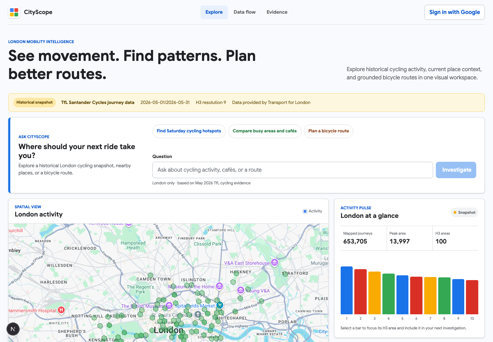
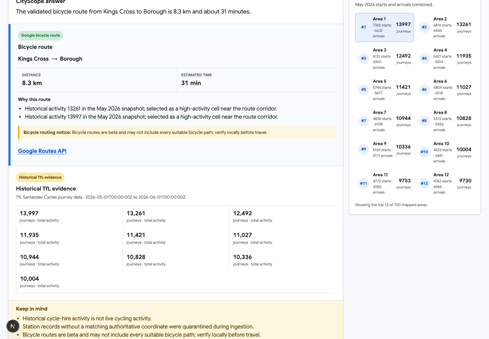
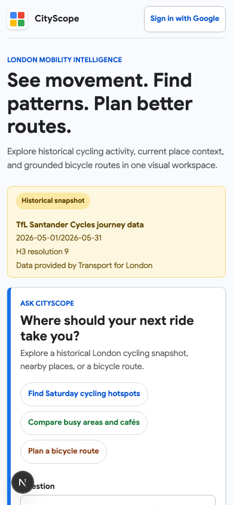
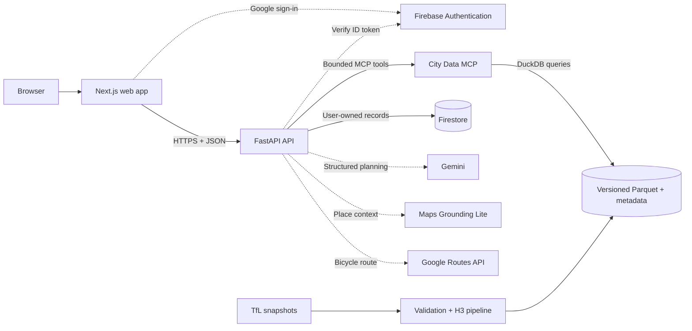

# CityScope

**Evidence-grounded geospatial intelligence for London cycling activity.**

[](https://github.com/Peippo1/CityScope/actions/workflows/ci.yml)


CityScope turns natural-language questions into bounded, traceable investigations over historical London cycling data. It combines deterministic H3 and DuckDB analytics with a guarded Gemini planning layer, current Google Maps context, bicycle routing, and user-owned investigation history.

**[Open the live CityScope app](https://cityscope-506222.web.app)**

## Product tour



CityScope keeps the map, interactive activity chart, request flow, and investigation controls in one workspace. Every visual separates the pinned historical TfL snapshot from current Google Maps context and Google bicycle routes.



<p align="center">
  
</p>

The current vertical slice can:

- rank and compare historical cycling activity across H3 cells;
- enrich trusted areas with current Google Maps place context;
- compute deterministic bicycle routes through selected activity areas;
- explore selectable activity charts and a request-flow view driven by real API trace state;
- show source-tagged evidence, dataset provenance, limitations, and execution traces;
- authenticate users with Google and save investigations through a Firebase-token-verified API.

> CityScope currently covers a pinned May 2026 TfL cycling snapshot for London. It does not claim live cycling conditions, weather, traffic, forecasts, or support for other cities.

## All Things Agentic Hackathon

CityScope is being built for the [All Things Agentic Hackathon](https://allthingsagentichackathon.devpost.com/), using Gemini 3.5 Flash through the Google GenAI SDK and production services on Google Cloud. The recommended submission category is **Taskmaster**: one bounded investigation can classify a goal, query deterministic city analytics, resolve current places, compute a bicycle route, and return a traceable visual result.

- [Read the build story](docs/blog/building-cityscope.md)
- [Review the Devpost submission draft](docs/devpost-submission.md)
- [Follow the four-minute demo plan](docs/hackathon-demo.md)

## Architecture

[Open the editable system architecture and investigation flow in FigJam](https://www.figma.com/board/qfv9Yo1Z88fcn7FBArJeTG)



The FastAPI service is the trust boundary. Browser Firestore access is denied; authenticated history operations pass a Firebase ID token to the API, which verifies ownership before reading or writing Firestore. The City Data MCP remains deterministic and private behind the API.

## Data Flow

```text
TfL snapshot -> validate and normalize -> H3 aggregation -> Parquet -> DuckDB
                                                               |
question -> guarded planner -> City Data MCP -------------------+
                          \-> Maps and Routes -> evidence-grounded result
```

Generated artifacts retain checksums, reconciliation counts, observation period, source attribution, and snapshot metadata. Large raw and generated datasets are intentionally excluded from Git.

## Quick Start

Prerequisites: Python 3.11+, Node.js 20+, and npm.

Install dependencies and build the deterministic fixture:

```bash
python3 -m venv .venv
source .venv/bin/activate
python -m pip install -e '.[dev]'
python -m pipelines.london_cycling.build_fixture

cd apps/web
npm install
cd ../..
```

Create `.env.local` from [`.env.example`](.env.example) and add only the providers you intend to use. Browser configuration belongs in `apps/web/.env.local`; never place server credentials in a `NEXT_PUBLIC_*` variable.

Start the complete local stack from the repository root:

```bash
python scripts/dev.py
```

The supervisor stops the whole stack if any service exits, preventing a web-only partial startup. It forwards only `NEXT_PUBLIC_*` values from the root `.env.local` to Next.js; server credentials are not passed to the web process. To run services independently, use three terminals:

```bash
# Terminal 1: deterministic City Data MCP
.venv/bin/uvicorn services.city_data_mcp.server:app --reload --port 8001

# Terminal 2: public API
.venv/bin/uvicorn apps.api.app.main:app --reload --port 8000

# Terminal 3: web app
cd apps/web
npm run dev
```

Open the URL printed by Next.js. Check API configuration at `http://localhost:8000/health` and dataset readiness at `http://localhost:8000/ready`.

### Configuration

Server-side configuration includes:

- `GEMINI_API_KEY` for structured investigation planning;
- `GOOGLE_MAPS_GROUNDING_API_KEY` for place search and endpoint resolution;
- `GOOGLE_ROUTES_API_KEY` for bicycle routing;
- `FIREBASE_PROJECT_ID` for token verification and saved investigations;
- `CITYSCOPE_CITY_DATA_MCP_URL` for the private MCP endpoint.

The web app uses separately restricted public configuration:

- `NEXT_PUBLIC_CITYSCOPE_API_URL`;
- `NEXT_PUBLIC_GOOGLE_MAPS_API_KEY`;
- `NEXT_PUBLIC_FIREBASE_API_KEY`, `NEXT_PUBLIC_FIREBASE_AUTH_DOMAIN`, `NEXT_PUBLIC_FIREBASE_PROJECT_ID`, and `NEXT_PUBLIC_FIREBASE_APP_ID`.

Without a browser Maps key, CityScope keeps the ranked textual experience available and displays a labelled map placeholder. Missing server providers produce bounded degraded or partial states rather than ungrounded answers.

## Repository Map

| Path | Responsibility |
| --- | --- |
| `apps/web` | Next.js investigation workspace, map, Firebase client auth |
| `apps/api` | FastAPI routes, policy boundary, agent orchestration, saved history |
| `services/city_data_mcp` | Stateless MCP tools over deterministic city analytics |
| `pipelines` | Source adapters, validation, H3 transforms, artifact builds |
| `evals` | Deterministic agent regression cases and runner |
| `docs` | Architecture decisions, deployment, data provenance, privacy |

## Verification

```bash
pytest -q
python -m evals.agent.runner --json-output /tmp/cityscope-eval-report.json

cd apps/web
npm test
npm run test:e2e
npm run build
```

CI also runs Python and npm dependency audits and whitespace checks. Live Gemini, Maps, and Routes smoke tests are deliberately opt-in so routine test runs do not consume provider quota.

## Documentation

- [Investigation model and guardrails](docs/investigations.md)
- [Data foundation and provenance](docs/data-foundation.md)
- [Cloud Run deployment runbook](docs/deployment.md)
- [Hackathon demo flow](docs/hackathon-demo.md)
- [Privacy and saved-investigation handling](docs/privacy.md)
- [Architecture decisions](docs/decisions)
