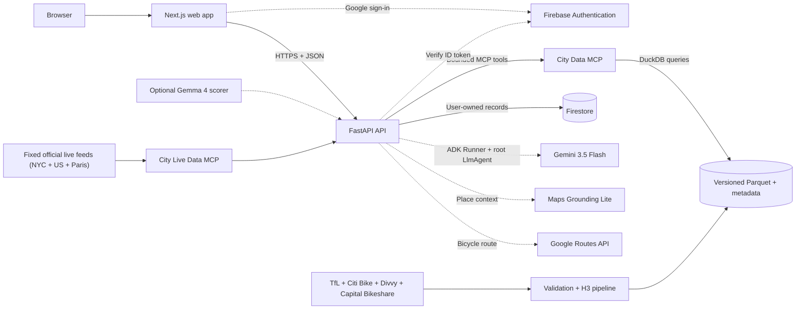

# CityScope

**An AI route planner for memorable runs and rides through a new city.**

[](https://github.com/Peippo1/CityScope/actions/workflows/ci.yml)


CityScope turns a natural-language travel request into a grounded city adventure: an actual running or cycling route, two to four interesting stops, and somewhere useful to eat or drink. A Google ADK root `LlmAgent`, powered by Gemini 3.5 Flash, interprets the outing; deterministic backend code matches curated route concepts, resolves real places with Google Maps Grounding, and validates final WALK or BICYCLE geometry through Google Routes. Historical mobility data remains optional supporting intelligence rather than a prerequisite for a good route.

**[Open CityScope](https://cityscope-506222.web.app)** · **[Read the public build story](https://cityscope-506222.web.app/blog/cityscope)**

## Product tour


Choose a city and whether to run or cycle, then describe a starting point, rough duration or distance, and the kind of experience you want. The map and concise itinerary dominate the result.


<p align="center">
  
</p>

The current prototype can:

- plan running and cycling routes with outbound and optional return legs;
- use curated London route ideas including Richmond Park, Thames Path, Regent's Canal, Greenwich, Wandle Trail, Lee Valley, and Epping Forest as scenic planning templates;
- use city-specific route ideas for New York City, Chicago, and Washington, DC when those route-capable workspaces are selected;
- explore curated European route concepts in Paris, Copenhagen, Barcelona, and Madrid; these are route-planning cities without historical CityScope mobility snapshots;
- suggest bounded Google Maps stops for coffee, bathrooms, lunch, shops, or repairs;
- suggest a small, deduplicated itinerary of real Google Maps places;
- send a route into Google Maps or share it using native Web Share/clipboard fallback;
- accept optional browser-native voice input;
- keep H3 mobility evidence, provenance and execution traces behind the consumer experience;
- enforce typed route intents, city bounds, waypoint budgets and provider-call limits.

> Historical comparisons use a matched May 2026 window and normalized metrics only. Activity is observed bike-share data, not a census of private or dockless cycling. Station availability is optional operational context, not historical trip demand. CityScope does not claim live cycling conditions, weather, traffic, or forecasts.

## All Things Agentic Hackathon

CityScope was built for the [All Things Agentic Hackathon](https://allthingsagentichackathon.devpost.com/), using Google ADK, Gemini 3.5 Flash through the Google GenAI SDK, Google Maps Grounding, Google Routes, and production services on Google Cloud. The agent performs one useful multi-step task: interpret an outing, select a city route concept, ground its places, calculate its geometry and return a portable plan.

- [Read the public build story](https://cityscope-506222.web.app/blog/cityscope)
- [Read the repository copy](docs/blog/building-cityscope.md)
- [Review the Devpost submission draft](docs/devpost-submission.md)
- [Follow the four-minute demo plan](docs/hackathon-demo.md)

## Architecture

[Open the editable system architecture and investigation flow in FigJam](https://www.figma.com/board/qfv9Yo1Z88fcn7FBArJeTG)



The FastAPI service is the trust boundary. Browser Firestore access is denied; authenticated history operations pass a Firebase ID token to the API, which verifies ownership before reading or writing Firestore. The City Data MCP remains deterministic and private behind the API.

## Data Flow

```text
Official trip snapshots -> validate and normalize -> H3 aggregation -> Parquet -> DuckDB
                                                               |
question -> ADK root planner -> City Data MCP -------------------+
                          \-> Maps and Routes -> evidence-grounded result
Optional live feeds -> City Live Data MCP -> validated, labelled station context
```

Generated artifacts retain checksums, per-reason reconciliation counts, local observation period, source attribution, and snapshot metadata. The production build accepts official CSV or ZIP archives in bounded chunks. Large raw, generated, and quarantine datasets are intentionally excluded from Git.

> A clean checkout uses clearly labelled deterministic fixtures until the official May 2026 source files are built with `pipelines.multicity.build_production`. The verified cohort build accepts 653,075 Chicago trips, 588,599 Washington, DC trips, and 4,680,767 New York trips; London contributes 854,872 accepted TfL trips. Fixture comparisons remain visibly labelled and must not be treated as findings.

After building or promoting all four production city artifacts, generate the fingerprint-bound comparison matrix:

```bash
.venv/bin/python -m pipelines.multicity.build_comparison
```

The API uses this small artifact for low-latency comparison reads only while its snapshot IDs, artifact names, and source checksums match the selected cohort. Missing or stale matrices fall back to deterministic Parquet calculations.

## Quick Start

Prerequisites: Python 3.11+, Node.js 20+, and npm.

Install dependencies and build the deterministic fixture:

```bash
python3 -m venv .venv
source .venv/bin/activate
python -m pip install -e '.[dev]'
python -m pipelines.london_cycling.build_fixture
python -m pipelines.multicity.build_fixture

cd apps/web
npm install
cd ../..
```

Create `.env.local` from [`.env.example`](.env.example) and add only the providers you intend to use. Browser configuration belongs in `apps/web/.env.local`; never place server credentials in a `NEXT_PUBLIC_*` variable.

Start the complete local stack from the repository root:

```bash
python scripts/dev.py
```

The supervisor stops the whole stack if any service exits, preventing a web-only partial startup. It forwards only `NEXT_PUBLIC_*` values from the root `.env.local` to Next.js; server credentials are not passed to the web process. To run services independently, use three terminals:

```bash
# Terminal 1: deterministic City Data MCP
.venv/bin/uvicorn services.city_data_mcp.server:app --reload --port 8001

# Terminal 2: optional live station MCP
.venv/bin/uvicorn services.city_live_data_mcp.server:app --reload --port 8002

# Terminal 3: public API
.venv/bin/uvicorn apps.api.app.main:app --reload --port 8000

# Terminal 4: web app
cd apps/web
npm run dev
```

Open the URL printed by Next.js. Check API configuration at `http://localhost:8000/health` and dataset readiness at `http://localhost:8000/ready`.

### Configuration

Server-side configuration includes:

- `GEMINI_API_KEY` for structured investigation planning;
- `GOOGLE_MAPS_GROUNDING_API_KEY` for place search and endpoint resolution;
- `GOOGLE_ROUTES_API_KEY` for bicycle routing;
- `FIREBASE_PROJECT_ID` for token verification and saved investigations;
- `CITYSCOPE_CITY_DATA_MCP_URL` for the private MCP endpoint.
- `CITYSCOPE_CITY_LIVE_DATA_MCP_URL` for the private live-data MCP endpoint.
- `CITYSCOPE_PARIS_ARCHIVE_BUCKET` for the hourly private GBFS archive job.

The live MCP joins fixed official feeds for Citi Bike, Divvy, Capital Bikeshare, and Vélib'. London remains historical-only because Santander supply is not representative of the wider cycling market. Paris remains the archive pilot: its deployed collector stores full validated snapshots hourly in a private regional bucket, and the UI exposes no trend claim until the archive is sufficiently mature.

The web app uses separately restricted public configuration:

- `NEXT_PUBLIC_CITYSCOPE_API_URL`;
- `NEXT_PUBLIC_GOOGLE_MAPS_API_KEY`;
- `NEXT_PUBLIC_FIREBASE_API_KEY`, `NEXT_PUBLIC_FIREBASE_AUTH_DOMAIN`, `NEXT_PUBLIC_FIREBASE_PROJECT_ID`, and `NEXT_PUBLIC_FIREBASE_APP_ID`.

The browser Places explorer uses the same referrer-restricted browser key. In Google Cloud, enable Maps JavaScript API, Places UI Kit, and Places API (New) for that key. Places UI Kit results are current Google Places context and are intentionally separate from historical bike-share evidence.

Without a browser Maps key, CityScope keeps the ranked textual experience available and displays a labelled map placeholder. Missing server providers produce bounded degraded or partial states rather than ungrounded answers.

## Repository Map

| Path | Responsibility |
| --- | --- |
| `apps/web` | Next.js investigation workspace, map, Firebase client auth |
| `apps/api` | FastAPI routes, policy boundary, agent orchestration, saved history |
| `services/city_data_mcp` | Stateless MCP tools over deterministic city analytics |
| `pipelines` | Source adapters, validation, H3 transforms, artifact builds |
| `evals` | Deterministic agent regression cases and runner |
| `docs` | Architecture decisions, deployment, data provenance, privacy |

## Verification

```bash
pytest -q
python -m evals.agent.runner --json-output /tmp/cityscope-eval-report.json

cd apps/web
npm test
npm run test:e2e
npm run build
```

CI also runs Python and npm dependency audits and whitespace checks. Live Gemini, Maps, and Routes smoke tests are deliberately opt-in so routine test runs do not consume provider quota.

The scheduled `cohort-source-monitor` validates monthly that the pinned production manifests still describe one matched snapshot and that every official source remains reachable. It does not silently replace the evidence window; promoting a new common month requires the same ingestion, reconciliation, checksum, and review gates as May 2026.

## Documentation

- [Investigation model and guardrails](docs/investigations.md)
- [Data foundation and provenance](docs/data-foundation.md)
- [Cloud Run deployment runbook](docs/deployment.md)
- [Hackathon demo flow](docs/hackathon-demo.md)
- [Privacy and saved-investigation handling](docs/privacy.md)
- [Architecture decisions](docs/decisions)
